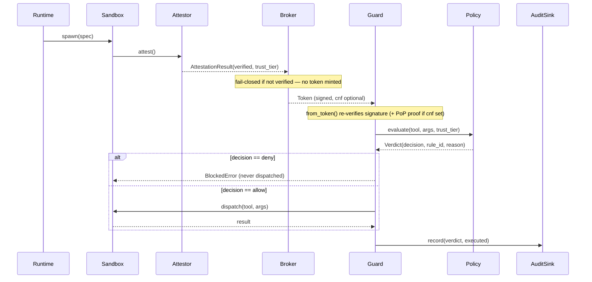
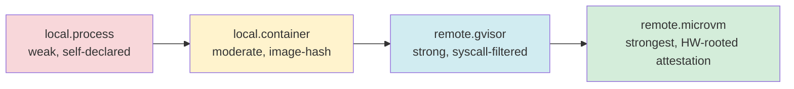

# Architecture

Component and sequence diagrams for the design in `docs/DESIGN.md`. Mermaid, not a static image — renders natively on GitHub and most markdown viewers without any extra tooling.

**On the PDF ask:** `pandoc` is available in this environment but has no working PDF engine installed (`pdflatex`, `wkhtmltopdf`, `weasyprint` — none present), so `pandoc Architecture.md -o Architecture.pdf` will fail as-is. Rather than install new system software without asking, or fake a conversion, this stays a `.md` — if a PDF is genuinely needed, `brew install basictex` (or `wkhtmltopdf`) would unblock `pandoc`'s existing PDF path, which is a one-line ask away, not a redesign.

## Component view

```mermaid
flowchart TB
    subgraph identity["agentguard_identity (who / where)"]
        Attestor["Attestor\n(LocalAttestor / ProviderAttestor)"]
        Broker["Broker\n(mint scoped Token)"]
        Runtime["Runtime\n(Local / Container / E2B)"]
        Sandbox["Sandbox\n(attest / dispatch / close)"]
        PoP["PoPKeypair\n(optional holder-binding)"]
    end

    subgraph guard["agent_guard (what)"]
        Policy["Policy\n(deterministic arg_patterns)"]
        Guard["Guard\n(decide / call / from_token)"]
        Judge["LLMJudge\n(tighten-only, bounded)"]
        CLI["CLI\n(run / explain / check / mcp)"]
    end

    subgraph audit["audit (did)"]
        Sink["AuditSink\n(Jsonl / Webhook / Signing / Multi)"]
    end

    Runtime -->|spawn| Sandbox
    Sandbox -->|attest| Attestor
    Attestor -->|verified result| Broker
    PoP -.->|pop_thumbprint, opt-in| Broker
    Broker -->|signed Token| Guard
    Guard -->|evaluate| Policy
    Policy -.->|ambiguous band only| Judge
    Guard -->|record| Sink
    CLI --> Guard
    Sandbox -->|dispatch\(tool, args\)| Guard
```

## Sequence — the binding flow (identity through to a tool call)



## Sequence — write-content scanning (the newest pillar)

```mermaid
sequenceDiagram
    participant Caller as Caller (Python or a shell hook)
    participant CLI as guard check
    participant G as Guard
    participant P as Policy (write-content-scan)
    participant AU as AuditSink

    Caller->>CLI: {"tool": "write", "args": {"content": ...}} on stdin
    Note over CLI: validates payload shape first —\nnon-dict / non-string tool fails closed\nwith a clean error, no traceback
    CLI->>G: decide(tool, args)
    G->>P: evaluate — same engine as shell/SQL policies
    P-->>G: Verdict
    G->>AU: record(executed=False)
    Note over AU: check never executes anything itself —\nit's a decision oracle; the caller acts on the exit code
    G-->>CLI: Verdict
    CLI-->>Caller: exit 0 (allow) / 3 (deny) / 4 (require_human) / 1 (usage error)
```

## Trust-tier gradient (isolation pillar)



A policy's `min_trust_tier` gates high-authority scopes to the right side of this gradient — a `local.process` identity cannot self-elevate regardless of what it claims about itself, because the tier comes from `Attestor.verify()`, not from the caller.
